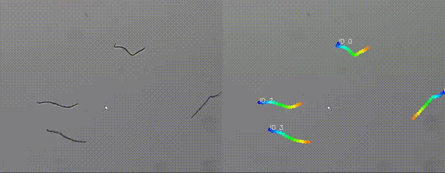
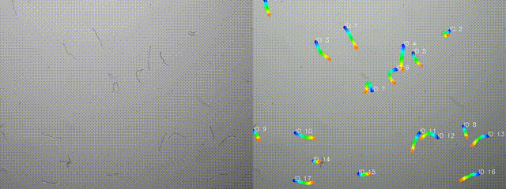

# Worm Tracker

A full-stack application for tracking *Caenorhabditis elegans* (C. elegans) in video data. The tracker extracts skeleton-based keypoints to capture body deformation over time — including head, body, and tail motion — enabling quantitative behavioral analysis.

<p align="center">
  
</p>

<p align="center">
  
</p>

**Stack:**
- **Backend** — Python + FastAPI (`/app`)
- **Frontend** — React + Vite (`/frontend`)

---

## Option A — Standalone macOS App (no setup required)

Build a self-contained `WormTracker.app` bundle (includes FFmpeg, no Python or Node needed on the target machine):

```bash
./build.sh
```

Then launch:
```bash
open dist/WormTracker.app
```

Or run directly to see server logs:
```bash
dist/WormTracker/WormTracker
```

> **Prerequisites for building:** Python venv at `~/venv/worm-tracker` with dependencies installed, Node.js 18+, and `npm`.

---

## Option B — Development Mode

Run backend and frontend separately with hot-reload.

### Prerequisites

1. **Python 3.9+** — <https://www.python.org/downloads/>
2. **Node.js v18+** — <https://nodejs.org> (also installs `npm`)
3. **FFmpeg** — for H.264 video transcoding during development
   - macOS: `brew install ffmpeg`
   - Linux: `apt install ffmpeg`
   - Windows: <https://www.gyan.dev/ffmpeg/builds/> or `choco install ffmpeg`

### Setup

#### 1. Clone the repository

```bash
git clone https://github.com/vclab/worm-tracker.git
cd worm-tracker
```

#### 2. Set up the Python environment

```bash
python -m venv ~/venv/worm-tracker
source ~/venv/worm-tracker/bin/activate   # macOS/Linux
# .\venv\Scripts\activate                 # Windows (use a local venv instead)
pip install -r requirements.txt
```

#### 3. Install frontend dependencies

```bash
cd frontend
npm install
cd ..
```

### Running in development

You need **two terminals** running simultaneously:

**Terminal 1 — backend:**
```bash
source ~/venv/worm-tracker/bin/activate
uvicorn app.main:app --reload --port 8000
```

**Terminal 2 — frontend:**
```bash
cd frontend
npm run dev
```

Then open **<http://127.0.0.1:5173>** in your browser.

The frontend connects directly to the backend at `http://127.0.0.1:8000` (configured in `frontend/src/api.js`). Both servers support hot-reload — changes to Python or React files take effect immediately.

### Shutting down

Press `Ctrl+C` in both terminals.

---

## How to Use

1. Open the app in your browser
2. Adjust tracking parameters if needed (Keypoints, Area Threshold, Max Age, Persistence)
3. Select one or more video files and click **Add to queue**
4. Jobs are processed one at a time — the **Job History** panel shows live progress
5. Click a completed job to load its results:
   - **Before/after comparison slider** — drag to reveal original vs. tracked video side by side
   - **Download All (ZIP)** — tracked video, original, keypoints (`.npz`), metadata (`.yaml`), motion stats (`.json`)
   - **Export CSV** — per-worm summary and per-frame timeseries data
   - **Head/Tail Correction** — flip head↔tail assignment for individual worms, then re-download
   - **Motion Analysis** — per-worm heatmap and timeline chart (overall, head, tail motion)
6. Use **Re-run with new parameters** to reprocess the same file with adjusted parameters
7. Use **Run on another file** to reset and process a new video

### Tracking parameters

| Parameter | Default | Description |
|---|---|---|
| Keypoints per worm | 15 | Skeleton sample points along each worm |
| Area threshold | 50 | Minimum pixel area to consider a blob a worm |
| Max age | 35 | Frames to keep tracking a worm after it disappears |
| Persistence | 50 | Minimum frames tracked to include a worm in output |

---

## Output Formats

| File | Format | Contents |
|---|---|---|
| `*_tracked.mp4` | H.264 video | Annotated video with colored skeleton keypoints and worm IDs |
| `*_original.*` | original format | Copy of the input video |
| `*_metadata.yaml` | YAML | Git version, timestamp, parameters, frame count |
| `*_keypoints.npz` | NumPy archive | Per-worm keypoint data — see details below |
| `*_motion_stats.json` | JSON | Per-worm motion values (overall, head, tail) and aggregate stats |
| `*_summary.csv` | CSV | One row per worm: mean motion values |
| `*_timeseries.csv` | CSV | One row per frame window: per-worm head/tail motion over time |

### Keypoints NPZ format

The NPZ file contains one NumPy array per worm, loadable with `np.load()`:

```python
import numpy as np

with np.load("*_keypoints.npz") as npz:
    print(list(npz.keys()))  # e.g. ['0', '1', 'partial_2', 'partial_3']
    arr = npz["0"]           # shape: (num_keypoints, num_frames, 2)
    y, x = arr[0, 0]         # [y, x] position of keypoint 0 at frame 0
```

**Array shape:** `(num_keypoints, num_frames, 2)` — axis 0 is keypoints along the skeleton (index 0 = head, index -1 = tail), axis 1 is frames, axis 2 is `[y, x]` pixel coordinates.

**Key naming convention:**

| Key pattern | Description |
|---|---|
| `"0"`, `"1"`, `"2"`, … | Fully retained worms — tracked for at least `persistence` frames and never touched a frame edge. Included in motion stats and CSV output. |
| `"partial_0"`, `"partial_2"`, … | Partial worms — touched one or more frame edges at some point and are therefore excluded from motion analysis. Stored for completeness and drawn in the annotated video with a distinct border colour. |

The numeric ID in a partial key matches the tracker's internal worm ID. A worm with key `"partial_5"` was assigned ID 5 during tracking.

**Head/tail orientation:** keypoint index 0 is the head (wider end of the skeleton) and index -1 is the tail (narrower end). This orientation can be corrected per-worm via the Head/Tail Correction tool in the UI, which reverses axis 0 in-place and regenerates all downstream outputs.

---

## File Locations

| Path | Description |
|---|---|
| `~/Documents/WormTracker/` | Default outputs folder (user-configurable) |
| `~/Documents/WormTracker/{job_id}/{timestamp}_name/` | All outputs for a job |
| `~/Documents/WormTracker/jobs.db` | SQLite job history — one per outputs folder |
| `~/Library/Application Support/WormTracker/config.json` | App config (macOS) |
| `~/Library/Application Support/WormTracker/uploads/` | Temp uploads, deleted after processing |

All output folders and databases are created automatically. The outputs directory can be changed via the **⚙ Settings** panel in the UI — useful for pointing to an external drive. Each outputs folder is fully self-contained (database lives inside it), so you can move or archive a folder and its job history travels with it.

> On Windows the config lives in `%APPDATA%/WormTracker/`; on Linux in `~/.config/WormTracker/`.

---

## What's in Git / What's Ignored

**Tracked (pushed to git):**
- `app/` — Python backend source
- `frontend/src/` — React source files
- `frontend/package.json`, `vite.config.js`, etc.
- `launcher.py` — entry point for the packaged app
- `worm_tracker.spec` — PyInstaller build recipe
- `build.sh` — one-command build script
- `validate_csv.py` — CSV output validation script
- `requirements.txt`, `CLAUDE.md`, `README.md`

**Ignored (not pushed):**
- User data (uploads, outputs, `jobs.db`) — lives outside the repo under `~/Library/Application Support/WormTracker/` and `~/Documents/WormTracker/`
- `frontend/node_modules/` — regenerated by `npm install`
- `frontend/dist/`, `dist/`, `build/` — regenerated by `npm run build` / `build.sh`
- `*.mp4`, `*.avi`, `*.mkv`, `*.npz`, `*.yaml`, `*.zip`, `*.log` — large/generated files

---

## Troubleshooting

**`command not found` (pip, python, node, npm)**
Ensure Python/Node are installed and on PATH. Close and reopen the terminal after installing.

**Frontend opens but video won't play**
Install FFmpeg (see prerequisites). The backend uses it to transcode to browser-compatible H.264.

**CORS or network errors in the browser**
Make sure the backend is running at `http://127.0.0.1:8000` before opening the frontend.

**Port already in use**
Run the frontend on a different port:
```bash
npm run dev -- --port 5174
```

**CLI usage (run tracker without the web UI)**
```bash
python -m app.worm_tracker input.mov output_dir --keypoints 15 --min-area 50 --max-age 35 --persistence 50
```
