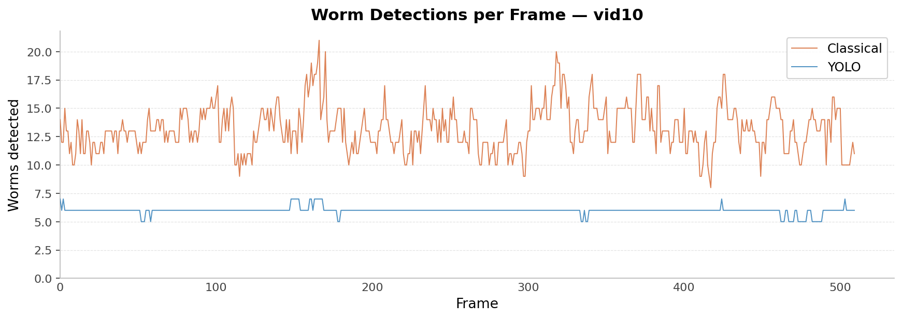
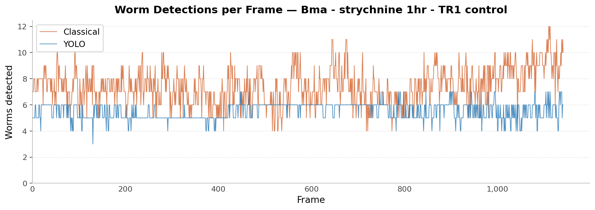
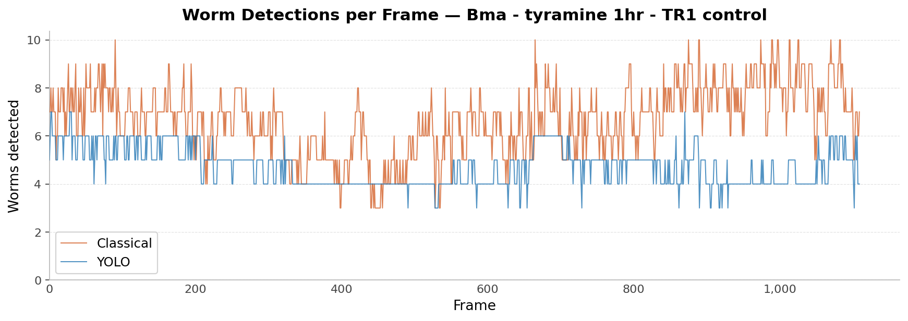
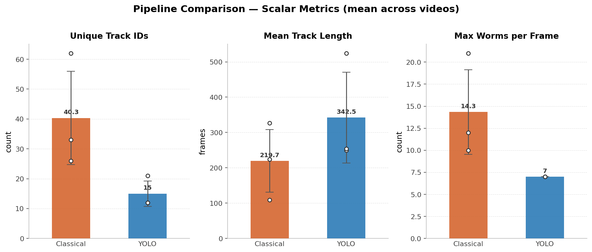
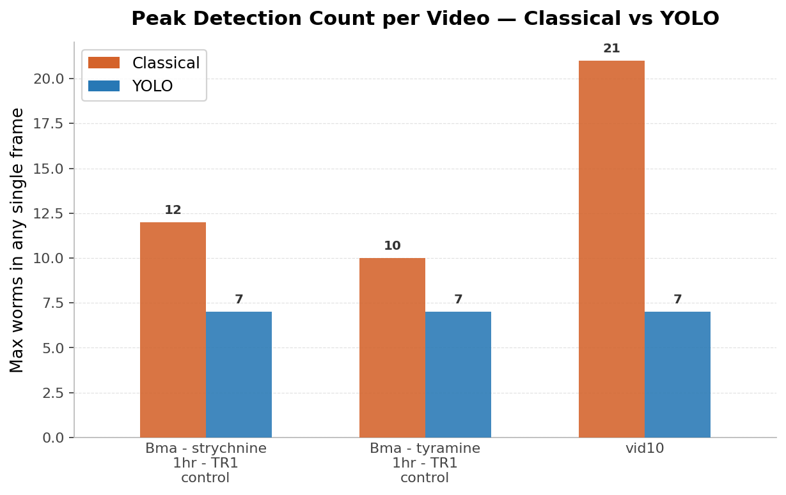

# ParaTracker

A full-stack application for *Microfilaria motion analysis*. The system uses skeleton-based keypoint extraction to capture body posture and deformation over time, enabling quantitative behavioral analysis. Two selectable tracking pipelines are available: a classical computer vision approach that requires no training data, and a deep learning pipeline powered by a custom-trained YOLOv8-seg instance segmentation model.

<p align="center">
  
</p>

## Features

### 🎥 Side-by-Side Video Comparison
Compare original and tracked videos with a synchronized draggable slider. See exactly how tracking overlays map to the raw footage.

<p align="center">
  
</p>

### 📊 Motion Analysis Dashboard
Color-coded heatmap showing overall, head, mid-body, and tail motion per worm. Click any row to view per-frame displacement charts with a rolling average for trend analysis. Hover legend items to isolate individual lines.

<p align="center">
  
</p>

### 📁 Multi-File Upload & Job Queue
Upload multiple videos and they queue and process sequentially. Full job history with view, download, and delete. Re-run any job with different parameters without re-uploading.

<p align="center">
  
</p>

### Additional Features

- **Dual Tracking Pipelines**: Select between the Classical pipeline (threshold-based, no training data required) or the YOLO deep learning pipeline (better on translucent and overlapping specimens) via a dropdown before uploading
- **Head/Tail Correction**: Manually flip head/tail assignment for individual worms, recomputes all metrics
- **Re-run with New Parameters**: Adjust parameters after processing and re-run on the same file
- **Cancel Processing**: Cancel active jobs mid-processing with automatic file cleanup
- **Info Tooltips**: Hover the ⓘ icon on each metric to see what it measures and how it is computed
- **Rolling Average Chart**: Smoothed trend line (window of 10) below the raw timeline to reveal activity patterns
- **Legend Hover Highlighting**: Hover a legend item to isolate that line on the chart
- **CSV/ZIP Export**: Download per-worm summary and per-frame timeseries data for external analysis

## Demo Videos

<!-- TODO: Add demo video links once recorded -->
<!-- 
| Video | Description |
|---|---|
| [Overview & Introduction](#) | What the project is and why it matters |
| [Upload & Processing](#) | Multi-file upload, job queue, cancellation |
| [Results & Comparison](#) | Video comparison slider, color-coded keypoints, head/tail correction |
| [Job Management](#) | Job history, re-run with new parameters, delete jobs |
| [Motion Analysis](#) | Heatmap, timeline charts, rolling average, legend hover |
| [Export & Data](#) | CSV/ZIP download, output file formats |
-->

*Coming soon: short walkthrough videos for each feature area.*

## How It Works

### Classical Pipeline

Frames are converted to grayscale, blurred, and passed through adaptive thresholding to produce a binary mask. Connected components extract individual worm blobs, which are then skeletonized using scikit-image's morphological skeletonization. Fifteen keypoints are sampled uniformly along each skeleton. Between frames, the Hungarian algorithm (via `scipy.optimize.linear_sum_assignment`) matches detections to existing tracks by centroid distance, maintaining stable IDs through occlusion gaps of up to `max_age` frames. No training data is required.

### YOLO Pipeline

Instead of thresholding and connected components, a custom-trained YOLOv8-seg model runs instance segmentation directly on each frame, producing one binary mask per worm. Each mask is passed to the same downstream skeletonization and Hungarian tracking used by the classical pipeline, so everything from keypoint extraction onward is shared code.

**Why YOLO?** The classical pipeline fails on translucent worms: uneven pixel intensity within a single worm body causes adaptive thresholding to split one worm into multiple disconnected blobs, creating false detections and fragmenting tracks. Instance segmentation treats each worm as a single object regardless of its internal intensity, eliminating this failure mode.

### Model Training

The training dataset was annotated in Roboflow and exported in COCO segmentation format, then converted to YOLO format for training with Ultralytics YOLOv8.

- **Key engineering finding:** a silent bug in the COCO-to-YOLO conversion was dropping all annotations stored in RLE (run-length encoding) mask format, passing them over in favor of polygon-only annotations. Fixing it by decoding RLE masks to polygons using `pycocotools` before conversion was the single biggest accuracy improvement, restoring a large fraction of training labels that had been silently discarded. Data quality mattered more than model size or architecture.

## Results: Classical vs YOLO Comparison

These metrics were computed on three real deployment videos using proxy tracking-quality signals. No ground-truth labels exist for these videos, so the metrics are indirect indicators of pipeline quality.

Lower unique-ID count and lower max-worms-per-frame indicate fewer false fragmentations, the primary failure mode of the classical pipeline on translucent worms.

| Video | Pipeline | Unique Track IDs | Mean Track Length (frames) | Max Worms / Frame |
|---|---|---|---|---|
| vid10 | Classical | 62 | 108.7 | 21 |
| vid10 | YOLO | **12** | **254.0** | **7** |
| Bma strychnine 1hr (control) | Classical | 26 | 326.7 | 12 |
| Bma strychnine 1hr (control) | YOLO | **12** | **524.3** | **7** |
| Bma tyramine 1hr (control) | Classical | 33 | 223.6 | 10 |
| Bma tyramine 1hr (control) | YOLO | **21** | **249.1** | **7** |

Across all three videos, YOLO produces substantially fewer unique IDs (fewer ghost tracks from fragmentation) and consistently longer mean track lengths, while the max worms per frame stays near the true worm count rather than spiking from false splits.

**Detection count over time: vid10**

Classical detection count spikes into the high teens and twenties as translucent worms are falsely split into multiple blobs. YOLO holds steady near the true worm count throughout the video.

<p align="center">
  
</p>

**Detection count over time: Bma strychnine 1hr**

<p align="center">
  
</p>

**Detection count over time: Bma tyramine 1hr**

<p align="center">
  
</p>

**Summary comparison (aggregate metrics across both pipelines)**

<p align="center">
  
</p>

**Per-video consistency (pattern holds across all three test videos)**

<p align="center">
  
</p>

*These are proxy metrics on a small set of videos, not a labeled benchmark.*

## Engineering Decisions & Learnings

- **Two-pipeline modular design.** Classical and YOLO pipelines are kept fully separate in the codebase, sharing only the downstream skeletonization and Hungarian tracking code. Neither pipeline's code path touches the other's, so iterating on the YOLO model does not risk breaking the classical baseline, and the classical pipeline remains available for high-contrast specimens where it already works well.

- **Drop-in detection replacement.** The YOLO pipeline replaces only the detection stage (thresholding plus connected components) with instance segmentation masks. Everything from skeletonization to motion metrics is unchanged. No part of the analytics or output layer needed modification to benefit from improved detections.

- **Selector instead of replacement.** Both pipelines are offered as a user-selectable dropdown in the UI rather than replacing one with the other. Researchers can choose the appropriate tool based on their video characteristics (high-contrast vs. translucent specimens) without committing to a single approach.

- **3-keypoint midbody metric.** Mid-body motion is computed by averaging displacement across the three middle keypoints rather than using a single midpoint. This reduces noise from local skeleton instability and produces a more stable per-frame signal.

- **Data quality over model complexity.** The silent RLE annotation bug described in the Model Training section meant the YOLO model was training with only a fraction of the intended labels. Fixing the conversion pipeline recovered those labels without changing the model architecture at all. Annotation completeness is a higher-leverage variable than model size when training data is scarce.

## Technology Stack

| Layer | Technology |
|---|---|
| Backend | Python 3, FastAPI |
| Frontend | React, Vite, Recharts |
| CV / Scientific | OpenCV, scikit-image, SciPy, NumPy |
| ML / Deep Learning | PyTorch (CUDA), Ultralytics YOLOv8-seg, pycocotools |
| Database | SQLite |
| Video | FFmpeg (H.264 transcoding) |
| Communication | Server-Sent Events (SSE) |

## Getting Started

### Option A: Standalone macOS App (no setup required)

Build a self-contained `WormTracker.app` bundle (includes FFmpeg, no Python or Node needed on the target machine):

```bash
./build.sh
```

Then launch:
```bash
open dist/WormTracker.app
```

Or run directly to see server logs:
```bash
dist/WormTracker/WormTracker
```

> **Prerequisites for building:** Python venv at `~/venv/worm-tracker` with dependencies installed, Node.js 18+, and `npm`.

### Option B: Development Mode

Run backend and frontend separately with hot-reload.

#### Prerequisites

1. **Python 3.9+** -- <https://www.python.org/downloads/>
2. **Node.js v18+** -- <https://nodejs.org> (also installs `npm`)
3. **FFmpeg** -- for H.264 video transcoding
   - macOS: `brew install ffmpeg`
   - Linux: `apt install ffmpeg`
   - Windows: <https://www.gyan.dev/ffmpeg/builds/> or `choco install ffmpeg`

#### Setup

```bash
# 1. Clone
git clone https://github.com/vclab/worm-tracker.git
cd worm-tracker

# 2. Python environment
python -m venv ~/venv/worm-tracker
source ~/venv/worm-tracker/bin/activate   # macOS/Linux
# .\venv\Scripts\activate                 # Windows
pip install -r requirements.txt

# 3. Frontend dependencies
cd frontend
npm install
cd ..
```

#### Running

Two terminals:

**Terminal 1: backend**
```bash
source ~/venv/worm-tracker/bin/activate
uvicorn app.main:app --reload --port 8000
```

**Terminal 2: frontend**
```bash
cd frontend
npm run dev
```

Open **<http://127.0.0.1:5173>** in your browser.

## How to Use

1. Open the app in your browser
2. Select the tracking pipeline: **Classical** (threshold-based, no training data required) or **YOLO** (deep learning, better on translucent or overlapping specimens)
3. Adjust tracking parameters if needed (Keypoints, Area Threshold, Max Age, Persistence)
4. Select one or more video files and click **Add to queue**
5. Jobs are processed one at a time -- the **Job History** panel shows live progress
6. Click a completed job to load its results:
   - **Before/after comparison slider**: drag to reveal original vs. tracked video
   - **Download All (ZIP)**: tracked video, original, keypoints (`.npz`), metadata (`.yaml`), motion stats (`.json`)
   - **Export CSV**: per-worm summary and per-frame timeseries data
   - **Head/Tail Correction**: flip head/tail assignment for individual worms, then re-download
   - **Motion Analysis**: per-worm heatmap and timeline chart (overall, head, mid-body, tail motion)
7. Use **Re-run with new parameters** to reprocess the same file with adjusted parameters
8. Use **Run on another file** to reset and process a new video

### Tracking Parameters

| Parameter | Default | Description |
|---|---|---|
| Keypoints per worm | 15 | Skeleton sample points along each worm |
| Area threshold | 50 | Minimum pixel area to consider a blob a worm |
| Max age | 35 | Frames to keep tracking a worm after it disappears |
| Persistence | 50 | Minimum frames tracked to include a worm in output |

## Output Formats

| File | Format | Contents |
|---|---|---|
| `*_tracked.mp4` | H.264 video | Annotated video with colored skeleton keypoints and worm IDs |
| `*_original.*` | original format | Copy of the input video |
| `*_metadata.yaml` | YAML | Git version, timestamp, parameters, frame count |
| `*_keypoints.npz` | NumPy archive | Per-worm keypoint data -- see details below |
| `*_motion_stats.json` | JSON | Per-worm motion values (overall, head, mid-body, tail) and aggregate stats |
| `*_summary.csv` | CSV | One row per worm: mean motion values (overall, head, mid-body, tail) |
| `*_timeseries.csv` | CSV | One row per frame window: per-worm head/mid-body/tail motion over time |

### Keypoints NPZ Format

```python
import numpy as np

with np.load("*_keypoints.npz") as npz:
    print(list(npz.keys()))  # e.g. ['0', '1', 'partial_2', 'partial_3']
    arr = npz["0"]           # shape: (num_keypoints, num_frames, 2)
    y, x = arr[0, 0]         # [y, x] position of keypoint 0 at frame 0
```

**Array shape:** `(num_keypoints, num_frames, 2)` -- axis 0 is keypoints along the skeleton (index 0 = head, index -1 = tail), axis 1 is frames, axis 2 is `[y, x]` pixel coordinates.

| Key pattern | Description |
|---|---|
| `"0"`, `"1"`, `"2"`, ... | Fully retained worms -- tracked for >= `persistence` frames and never touched a frame edge |
| `"partial_0"`, `"partial_2"`, ... | Partial worms -- touched a frame edge, excluded from motion analysis |

**Head/tail orientation:** keypoint 0 = head (wider end), keypoint -1 = tail (narrower end). Correctable via the Head/Tail Correction tool.

## File Locations

| Path | Description |
|---|---|
| `~/Documents/WormTracker/` | Default outputs folder (user-configurable) |
| `~/Documents/WormTracker/{job_id}/{timestamp}_name/` | All outputs for a job |
| `~/Documents/WormTracker/jobs.db` | SQLite job history |
| `~/Library/Application Support/WormTracker/config.json` | App config (macOS) |

All output folders and databases are created automatically. The outputs directory can be changed via **Settings** (the ⚙ button) in the UI.

> On Windows: `%APPDATA%/WormTracker/` · On Linux: `~/.config/WormTracker/`

## Troubleshooting

| Problem | Solution |
|---|---|
| `command not found` (pip, python, node) | Ensure Python/Node are installed and on PATH. Restart terminal. |
| Video won't play in browser | Install FFmpeg (see prerequisites) |
| CORS / network errors | Make sure backend is running at `http://127.0.0.1:8000` |
| Port already in use | `npm run dev -- --port 5174` |

### CLI Usage (no UI)

```bash
python -m app.worm_tracker input.mov output_dir --keypoints 15 --min-area 50 --max-age 35 --persistence 50
```

## Authors

- [Aaveg Shangari](https://avishangari.github.io/aaveg-portfolio/index.html) (*[linkedin](https://www.linkedin.com/in/aaveg-shangari/)*)
- Faisal Qureshi

[VCLab](https://www.vclab.ca), Faculty of Science, Ontario Tech University
