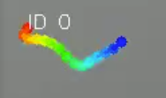

# ParaTracker

**Quantitative motion analysis for *C. elegans* and microfilaria — from raw video to publication-ready data, on your desktop.**

ParaTracker turns microscopy videos of worms into structured behavioral data. It detects each animal, extracts a skeleton-based set of keypoints along its body, and tracks how that posture deforms over time — giving you per-worm, per-region motion metrics you can compare across conditions. It runs as a local desktop app: drop in a video, watch it process, and download annotated video plus analysis-ready CSVs.

<p align="center">
  
</p>

---

## Overview

### The problem

Scoring worm motility by hand is slow, subjective, and hard to reproduce. Existing tools often demand command-line fluency, a specific OS, or a cloud upload of unpublished data. ParaTracker is built for wet-lab researchers who want rigorous, repeatable motion quantification **locally**, with no coding and no data leaving their machine.

### What it does

- **Two tracking pipelines, one click apart.** A **classical** computer-vision pipeline (adaptive threshold → skeletonization → Hungarian tracking) that needs no training data, and a **deep-learning** pipeline built on a custom-trained **YOLOv8-seg** model for translucent, overlapping, or low-contrast specimens.
- **Skeleton keypoints, not just centroids.** Each worm is reduced to an ordered set of keypoints from head to tail, so you capture body *deformation* — not merely whether the animal moved.
- **Region-resolved motion.** Separate metrics for **head**, **mid-body**, and **tail**, plus an overall score, per worm and over time.
- **Head/tail correction built in.** Auto-orientation is good, but you can flip any worm's head/tail assignment in the UI and everything downstream recomputes.
- **Cross-condition comparison.** Group videos into conditions and export grouped comparison charts and statistics.
- **Runs entirely on your machine.** No account, no server, no upload. Ships as a signed macOS `.app` / DMG and a standalone Windows `.exe`.

### See it in action

<table>
  <tr>
    <td width="50%" align="center">
      <br/>
      <sub><b>Before/after slider</b> — drag to reveal original vs. tracked video.</sub>
    </td>
    <td width="50%" align="center">
      <br/>
      <sub><b>Skeleton keypoints</b> — color-coded head→tail, with per-worm IDs.</sub>
    </td>
  </tr>
  <tr>
    <td width="50%" align="center">
      <br/>
      <sub><b>Motion analysis</b> — per-worm heatmap and timeline for head, mid-body, and tail.</sub>
    </td>
    <td width="50%" align="center">
      <br/>
      <sub><b>Tunable parameters</b> — keypoints, area threshold, max age, persistence.</sub>
    </td>
  </tr>
  <tr>
    <td width="50%" align="center">
      <br/>
      <sub><b>Condition comparison</b> — aggregate motion across experimental groups.</sub>
    </td>
    <td width="50%" align="center">
      <br/>
      <sub><b>Per-video consistency</b> — spot outliers and batch effects at a glance.</sub>
    </td>
  </tr>
</table>

### Who it's for

- **Neurobiology / pharmacology labs** screening drug or genotype effects on worm locomotion.
- **Parasitology labs** quantifying microfilaria motility for anthelmintic assays.
- **Anyone** who needs reproducible, per-region motion metrics without writing tracking code or shipping data to the cloud.

### Technology stack

| Layer | Technology |
|---|---|
| Backend | Python 3.11, FastAPI, SQLite |
| Frontend | React, Vite, Recharts |
| CV / scientific | OpenCV, scikit-image, SciPy, NumPy |
| Deep learning | PyTorch, Ultralytics YOLOv8-seg |
| Video | FFmpeg (bundled via `imageio-ffmpeg`, H.264 transcoding) |

### Demo videos

*Coming soon: short walkthrough videos covering upload & processing, results & comparison, job management, motion analysis, and export.*

---

## Installation & Development

ParaTracker runs as a **backend** (FastAPI, port 8000) plus a **frontend dev server** (Vite, port 5173). Helper scripts install dependencies, download the tracking model, free the ports, and start both together — a `Makefile` on macOS/Linux and an equivalent `dev.ps1` on Windows.

**What you'll need on any OS:**

- **Python 3.11** — use this exact version. `requirements.txt` pins `numpy<2` (NumPy 2.x breaks the scikit-image/OpenCV stack), and NumPy 1.x has **no wheels for Python 3.13+**, so installation fails on newer Pythons.
- **Node.js 18+** (includes `npm`).
- **FFmpeg is *not* a prerequisite** — the `imageio-ffmpeg` package (installed into the virtual environment automatically) bundles a static FFmpeg binary the app uses for H.264 transcoding. A system FFmpeg on your `PATH` is used only as a fallback.

You only do the setup once. Pick your platform:

### Windows

**1. Install prerequisites (PowerShell):**

```powershell
winget install Python.Python.3.11
winget install OpenJS.NodeJS
```

**2. Allow the helper script to run (one time, no admin needed).** PowerShell blocks local scripts by default, so `.\dev.ps1` fails the first time with `running scripts is disabled on this system`. Fix it once:

```powershell
Set-ExecutionPolicy -Scope CurrentUser -ExecutionPolicy RemoteSigned
```

Answer `Y` when prompted. (Prefer not to change any policy? Prefix each command instead: `powershell -ExecutionPolicy Bypass -File .\dev.ps1 <target>`.)

**3. Get the code:**

```powershell
git clone https://github.com/vclab/worm-tracker.git
cd worm-tracker
```

**4. Download the tracking model** (required once; SHA256-verified):

```powershell
.\dev.ps1 weights
```

**5. Start the app:**

```powershell
.\dev.ps1 run
```

This creates the virtual environment (`.\venv`), installs dependencies, and starts both servers. Open **<http://127.0.0.1:5173>**. Press **Ctrl+C** to stop both.

### macOS

**1. Install prerequisites** (via [Homebrew](https://brew.sh); `make` comes from Apple's Command Line Tools):

```bash
xcode-select --install        # provides `make`, if you don't already have it
brew install python@3.11 node
```

**2. Get the code:**

```bash
git clone https://github.com/vclab/worm-tracker.git
cd worm-tracker
```

**3. Download the tracking model** (required once; SHA256-verified):

```bash
make weights
```

**4. Start the app:**

```bash
make run
```

This creates the virtual environment (`~/venv/worm-tracker`), installs dependencies, and starts both servers. Open **<http://127.0.0.1:5173>**. Press **Ctrl+C** to stop both. (If you skip step 3, `make run` will download the model for you.)

### Linux

**1. Install prerequisites** (Debian/Ubuntu shown; `python3.11` may need the deadsnakes PPA):

```bash
sudo apt install python3.11 python3.11-venv nodejs npm make
```

**2. Get the code:**

```bash
git clone https://github.com/vclab/worm-tracker.git
cd worm-tracker
```

**3. Download the tracking model** and **4. start the app:**

```bash
make weights
make run
```

Open **<http://127.0.0.1:5173>**. Press **Ctrl+C** to stop both. Linux is a development target only — there is no packaged `.deb`/`.rpm`/AppImage.

### Command reference

**macOS / Linux (`make <target>`):**

| Target | What it does |
| --- | --- |
| `make run` | Start backend + frontend (ensures venv, deps, weights) |
| `make weights` | Download and verify the YOLO model |
| `make venv` | Create the Python environment (`~/venv/worm-tracker`) and install requirements |
| `make build` | Install frontend dependencies |
| `make dist` / `make dmg` / `make release` | Build the macOS app / DMG (see [Building for Distribution](#building-for-distribution)) |
| `make clean` | Remove caches, frontend build, and `build/`+`dist/` |
| `make clean-python` / `clean-python-env` / `clean-frontend` / `clean-weights` | Targeted cleanup |

**Windows (`.\dev.ps1 <target>`):**

| Target | What it does |
| --- | --- |
| `.\dev.ps1 run` | Start backend + frontend |
| `.\dev.ps1 weights` | Download and verify the YOLO model |
| `.\dev.ps1 venv` | Create the Python environment (`.\venv`) and install requirements |
| `.\dev.ps1 build` | Install frontend dependencies |
| `.\dev.ps1 clean` / `clean-python` / `clean-python-env` / `clean-frontend` / `clean-weights` | Cleanup |

> The venv location differs per OS: `~/venv/worm-tracker` on macOS/Linux, `.\venv` inside the project folder on Windows.

> **NumPy note:** NumPy must stay below 2 (2.x breaks the image-processing stack). It is pinned to `numpy<2` in `requirements.txt`; don't manually upgrade it.

### Manual run (advanced)

To start the servers yourself instead of using the scripts (skips the automatic port-cleanup and clean shutdown; download the model first):

```bash
# Terminal 1: backend
source ~/venv/worm-tracker/bin/activate      # macOS/Linux
# .\venv\Scripts\activate                    # Windows (PowerShell)
uvicorn app.main:app --reload --port 8000

# Terminal 2: frontend
cd frontend
npm run dev
```

---

## Building for Distribution

Both packaged builds are **self-contained** — they bundle Python, FFmpeg, and the YOLO weights, so the target machine needs no Python, Node, or FFmpeg. The YOLO model has been bundled since v1.4.1, so **both pipelines work out of the box** in the packaged app; a user can still point `model_path` at a different `.pt` file in Settings (⚙).

### macOS — building the DMG

Produce a `ParaTracker.app` that runs on machines with no dev tools installed:

```bash
make dist        # full clean rebuild; ad-hoc signs the .app
```

Launch it locally with:

```bash
open dist/ParaTracker.app       # normal launch
dist/ParaTracker/ParaTracker    # folder-mode binary; shows server logs in the terminal
```

Package the `.app` into a DMG for distribution (this is what we upload to GitHub Releases):

```bash
make release     # = make dist + make dmg
```

This produces `dist/ParaTracker-<version>-arm64.dmg`. Use `make dmg` on its own to repackage an existing `.app` without rebuilding.

**Notes:**
- **Apple Silicon only (arm64).** Intel Macs are not supported.
- **Ad-hoc signed, not notarized** (this is free research software). Gatekeeper shows a warning on first launch; the bundled *READ ME FIRST.txt* walks users through the one-time right-click → **Open** step to bypass it.
- The version comes from `CFBundleShortVersionString` in `worm_tracker.spec`.

### Windows — building the .exe

First complete the setup steps above (venv created, weights downloaded), then:

```powershell
.\build_windows.ps1
```

This builds the frontend and packages the app with PyInstaller into `dist\ParaTracker\` (an **onedir** build — a folder containing `ParaTracker.exe` plus an `_internal\` directory). Launch it by double-clicking:

```
dist\ParaTracker\ParaTracker.exe
```

It starts the server in the background and opens your browser automatically — **no console window**.

**Notes:**
- **Distribute by zipping the whole `dist\ParaTracker\` folder** (not just the `.exe` — it needs `_internal\`).
- **Not code-signed.** Windows SmartScreen shows "Windows protected your PC" on first launch → click **More info → Run anyway** (once per install).
- Uses a dedicated spec, `worm_tracker_windows.spec` (kept in sync with the macOS `worm_tracker.spec`).

### Running a build someone sent you

If you received a `ParaTracker` zip rather than building it yourself:

1. Extract the zip anywhere on your computer.
2. Open the extracted `ParaTracker` folder.
3. Double-click **`ParaTracker.exe`** (Windows) or the `.app` (macOS).

The app starts a local server in the background and opens your browser automatically — no installation. On Windows, click through the SmartScreen prompt (**More info → Run anyway**); on macOS, right-click → **Open** the first time.

---

## Using the App

1. Open the app in your browser.
2. Select the tracking pipeline: **Classical** (threshold-based, no training data required) or **YOLO** (deep learning, better on translucent or overlapping specimens).
3. Adjust tracking parameters if needed (see below).
4. Select one or more video files and click **Add to queue**.
5. Jobs process one at a time — the **Job History** panel shows live progress.
6. Click a completed job to load its results:
   - **Before/after comparison slider** — drag to reveal original vs. tracked video.
   - **Download All (ZIP)** — tracked video, original, keypoints (`.npz`), metadata (`.yaml`), motion stats (`.json`).
   - **Export CSV** — per-worm summary and per-frame timeseries.
   - **Head/Tail Correction** — flip head/tail for individual worms, then re-download.
   - **Motion Analysis** — per-worm heatmap and timeline (overall, head, mid-body, tail).
7. Use **Re-run with new parameters** to reprocess the same file with different settings.
8. Use **Run on another file** to reset and process a new video.

### Tracking parameters

| Parameter | Default | Description |
|---|---|---|
| Keypoints per worm | 15 | Skeleton sample points along each worm |
| Area threshold | 50 | Minimum pixel area to consider a blob a worm |
| Max age | 35 | Frames to keep tracking a worm after it disappears |
| Persistence | 50 | Minimum frames tracked to include a worm in output |

### Quitting a packaged app

Close the browser tab and the app shuts down automatically about 20 seconds later (a heartbeat watchdog). If a job is still processing, the server waits for it to finish first. Double-clicking the app while it is already running brings the existing browser tab forward instead of starting a second copy.

### Export and download options

Results can be exported in a few places. The two **Metrics** page exports produce analysis-ready ZIPs; the **History** page offers per-job downloads of the raw tracking outputs.

**Metrics page — Condition comparison export.** The **Export** button under *Condition comparison* downloads a ZIP for all the groups you've built:
- **Grouped comparison chart** as **PNG** and **SVG**.
- **`group_summary.csv`** — one row per group × pipeline, with worm count (`n`) and mean + standard deviation for head, mid-body, and tail motion.
- **`per_worm.csv`** — the raw per-worm rows behind those averages (group, video, pipeline, worm ID, and head/mid-body/tail/overall motion).

**Metrics page — Single video analysis export.** The **Export** button under *Single video analysis* downloads a ZIP for the selected video: the **drill-down chart** (PNG + SVG) plus that video's **summary CSV**, **timeseries CSV**, **`motion_stats.json`**, **metadata YAML**, and **`*_keypoints.npz`** — the complete, reproducible package for one video.

**History page — per-job downloads.** Each job row has its own actions:
- **View** — open the tracked result in the app.
- **Video** — download the tracked H.264 MP4.
- **ZIP** — the job's **package ZIP** (`{output_name}.zip`):

  | File | Description |
  | --- | --- |
  | `*_original.*` | Copy of the originally uploaded video |
  | `*_tracked.mp4` | H.264 video annotated with colored skeleton keypoints and worm IDs |
  | `*.yaml` | Metadata: git version, timestamp, parameters, frame count |
  | `*_keypoints.npz` | Per-worm skeleton keypoints over time (`[y, x]` per keypoint per frame; edge-touching worms under a `partial_` key prefix) |
  | `*_motion_stats.json` | Per-worm motion values (overall, head, mid-body, tail) and aggregate stats |

  The package ZIP does **not** include CSVs; those are in the separate `_data.zip`.
- **CSV** — the job's **data ZIP** (`{output_name}_data.zip`):

  | File | Description |
  | --- | --- |
  | `*_summary.csv` | One row per worm: mean motion values (overall, head, mid-body, tail) |
  | `*_timeseries.csv` | One row per frame window: per-worm head/mid-body/tail motion over time |
- **Delete** — remove the job and its outputs.

### Keypoints NPZ format

```python
import numpy as np

with np.load("*_keypoints.npz") as npz:
    print(list(npz.keys()))  # e.g. ['0', '1', 'partial_2', 'partial_3']
    arr = npz["0"]           # shape: (num_keypoints, num_frames, 2)
    y, x = arr[0, 0]         # [y, x] position of keypoint 0 at frame 0
```

**Array shape:** `(num_keypoints, num_frames, 2)` — axis 0 is keypoints along the skeleton (index 0 = head, index -1 = tail), axis 1 is frames, axis 2 is `[y, x]` pixel coordinates.

| Key pattern | Description |
|---|---|
| `"0"`, `"1"`, `"2"`, ... | Fully retained worms — tracked for ≥ `persistence` frames and never touched a frame edge |
| `"partial_0"`, `"partial_2"`, ... | Partial worms — touched a frame edge, excluded from motion analysis |

**Head/tail orientation:** keypoint 0 = head (wider end), keypoint -1 = tail (narrower end). Correctable via the Head/Tail Correction tool.

---

## CLI Usage (no UI)

Two separate module entry points; there is no unified `--pipeline` flag.

**Classical pipeline** (no model needed):

```bash
python -m app.worm_tracker input.mov output_dir \
    --keypoints 15 --min-area 50 --max-age 35 --persistence 50
```

**YOLO pipeline** (needs a weights file, e.g. from `make weights`):

```bash
python -m app.dl_worm_tracker input.mov output_dir \
    --model weights/worm_yolov8seg-<sha>.pt \
    --keypoints 15 --min-area 50 --max-age 35 --persistence 50 \
    --conf-threshold 0.25
```

Both write to `output_dir/{timestamp}_{output_name}/` and produce the same output-file layout as the web UI.

---

## Troubleshooting

| Problem | Solution |
|---|---|
| `command not found` (pip, python, node) | Ensure Python/Node are installed and on `PATH`. Restart the terminal. |
| `pip install` fails on `numpy` | You're likely on Python 3.13+. `numpy<2` has no wheels there — install and use **Python 3.11**. |
| `running scripts is disabled on this system` (Windows) | PowerShell blocks local scripts by default. Run `Set-ExecutionPolicy -Scope CurrentUser -ExecutionPolicy RemoteSigned`, or invoke via `powershell -ExecutionPolicy Bypass -File .\dev.ps1 <target>`. |
| Video won't play in browser | FFmpeg is bundled (`imageio-ffmpeg`); if H.264 transcoding failed, the app falls back to a raw `.mp4` some browsers can't play. Check the backend logs for an FFmpeg error and re-run the job — the data files are unaffected. |
| CORS / network errors | Make sure the backend is running at `http://127.0.0.1:8000`. |
| Port already in use | `npm run dev -- --port 5174`. |
| "app is damaged" / "cannot verify developer" on macOS | Right-click the app → **Open** → **Open**. First launch only. See the bundled *READ ME FIRST.txt*. |
| Windows SmartScreen: "Windows protected your PC" | Click **More info → Run anyway**. First launch only (the app isn't code-signed). |
| Packaged app launches but no browser tab appears | Ensure a default browser is set. The active port is written to `~/Documents/ParaTracker/paratracker.port`; open `http://127.0.0.1:<that-port>` manually. |
| Double-clicked the app and nothing happens | It's already running — it brought the existing browser tab forward. Check your open tabs. |
| Server keeps running after closing the browser | Give it ~20 seconds (heartbeat watchdog). Force-quit from Activity Monitor / Task Manager if needed. |

---

## Uninstalling

A full uninstall removes three things: the app, its **config** directory, and its **outputs** directory (job history, results, settings). Removing only the app leaves your data on disk.

**macOS:**

```bash
rm -rf /Applications/ParaTracker.app                # the app
rm -rf ~/Library/Application\ Support/ParaTracker   # config (settings, model path)
rm -rf ~/Documents/ParaTracker                      # outputs: jobs.db, videos, keypoints, CSVs, uploads
```

**Windows** (the app is a standalone folder, not an installer — nothing is registered in "Programs & Features"):

```powershell
Remove-Item -Recurse -Force "path\to\ParaTracker"                      # the extracted app folder
Remove-Item -Recurse -Force "$env:APPDATA\ParaTracker"                 # config
Remove-Item -Recurse -Force "$env:USERPROFILE\Documents\ParaTracker"   # outputs
```

**Linux:**

```bash
rm -rf ~/.config/ParaTracker                        # config
rm -rf ~/Documents/ParaTracker                      # outputs
```

- **Moved your outputs directory** via Settings (⚙) to a custom location? Delete that location instead of `~/Documents/ParaTracker`. The path is stored under `outputs_dir` in `config.json` in the config directory above.
- **Upgrading from v1.3.0 or earlier?** The app was previously named *WormTracker*. On first launch of v1.4.0+, the old `WormTracker` config and outputs directories are automatically renamed to `ParaTracker` in place — your jobs and settings carry over untouched.
- **Built from source?** Also run `make clean-python-env` / `.\dev.ps1 clean-python-env` (venv), `make clean-weights` / `.\dev.ps1 clean-weights` (model), and delete the project folder.

---

## Authors

- [Aaveg Shangari](https://avishangari.github.io/aaveg-portfolio/index.html) (*[LinkedIn](https://www.linkedin.com/in/aaveg-shangari/)*)
- Faisal Qureshi

[VCLab](https://www.vclab.ca), Faculty of Science, Ontario Tech University
