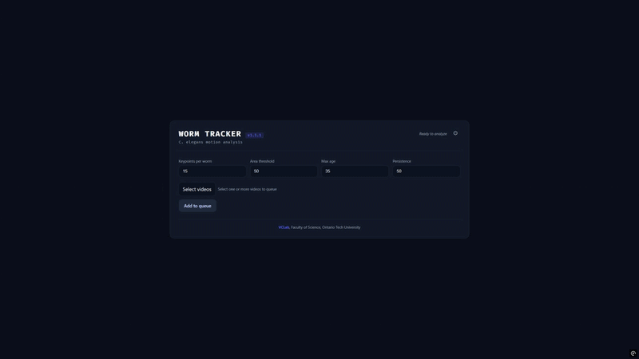
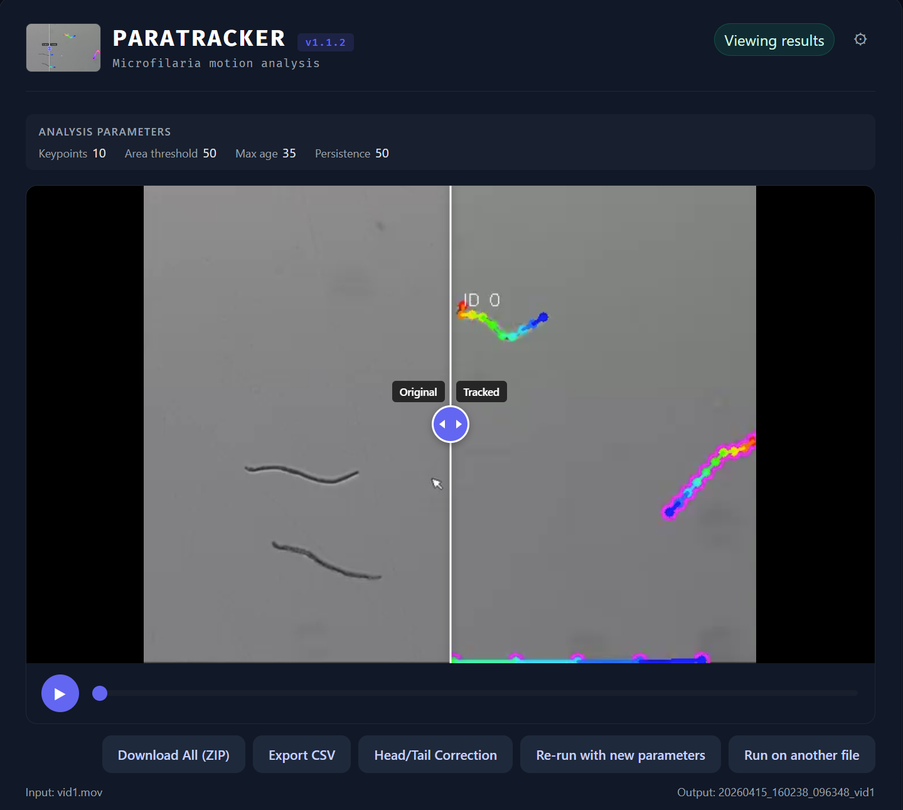
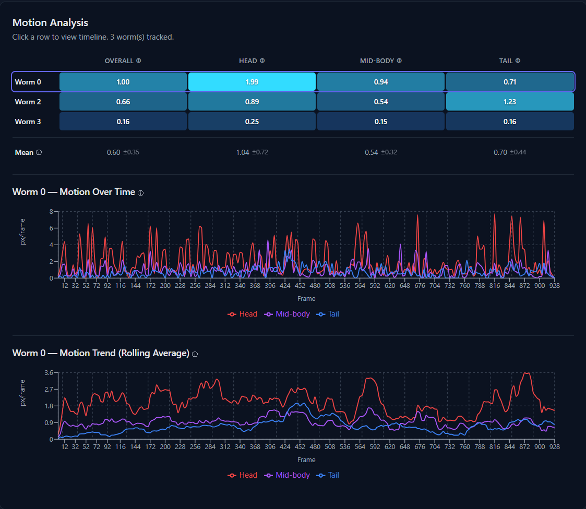
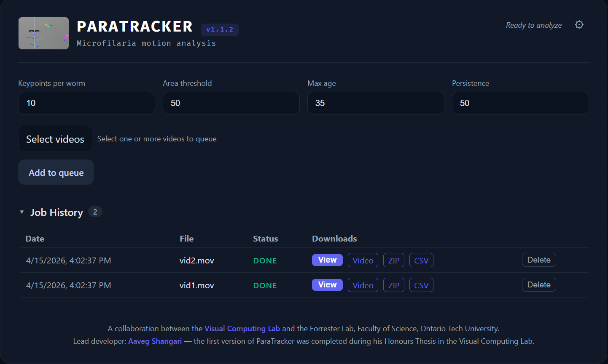

# Worm Tracker

A full-stack application for tracking *Caenorhabditis elegans* (C. elegans) in video. The system uses skeleton-based keypoint extraction to capture body posture and deformation over time, enabling quantitative behavioral analysis without any training data.

<p align="center">
  
</p>

---

## Features

### 🎥 Side-by-Side Video Comparison
Compare original and tracked videos with a synchronized draggable slider. See exactly how tracking overlays map to the raw footage.

<p align="center">
  
</p>

---

### 📊 Motion Analysis Dashboard
Color-coded heatmap showing overall, head, mid-body, and tail motion per worm. Click any row to view per-frame displacement charts with a rolling average for trend analysis. Hover legend items to isolate individual lines.

<p align="center">
  
</p>

---

### 📁 Multi-File Upload & Job Queue
Upload multiple videos — they queue and process sequentially. Full job history with view, download, and delete. Re-run any job with different parameters without re-uploading.

<p align="center">
  
</p>

### Additional Features

- **Head/Tail Correction** — Manually flip head↔tail assignment for individual worms, recomputes all metrics
- **Re-run with New Parameters** — Adjust parameters after processing and re-run on the same file
- **Cancel Processing** — Cancel active jobs mid-processing with automatic file cleanup
- **Info Tooltips** — Hover ⓘ icons on each metric to see what it measures and how it's computed
- **Rolling Average Chart** — Smoothed trend line (window of 10) below the raw timeline to reveal activity patterns
- **Legend Hover Highlighting** — Hover a legend item to isolate that line on the chart
- **CSV/ZIP Export** — Download per-worm summary and per-frame timeseries data for external analysis

---

## Demo Videos

<!-- TODO: Add demo video links once recorded -->
<!-- 
| Video | Description |
|---|---|
| [Overview & Introduction](#) | What the project is and why it matters |
| [Upload & Processing](#) | Multi-file upload, job queue, cancellation |
| [Results & Comparison](#) | Video comparison slider, color-coded keypoints, head/tail correction |
| [Job Management](#) | Job history, re-run with new parameters, delete jobs |
| [Motion Analysis](#) | Heatmap, timeline charts, rolling average, legend hover |
| [Export & Data](#) | CSV/ZIP download, output file formats |
-->

*Coming soon — short walkthrough videos for each feature area.*

---

## Stack

| Layer | Technology |
|---|---|
| Backend | Python 3, FastAPI |
| Frontend | React, Vite, Recharts |
| CV / Scientific | OpenCV, scikit-image, SciPy, NumPy |
| Database | SQLite |
| Video | FFmpeg (H.264 transcoding) |
| Communication | Server-Sent Events (SSE) |

---

## Getting Started

### Option A — Standalone macOS App (no setup required)

Build a self-contained `WormTracker.app` bundle (includes FFmpeg, no Python or Node needed on the target machine):

```bash
./build.sh
```

Then launch:
```bash
open dist/WormTracker.app
```

Or run directly to see server logs:
```bash
dist/WormTracker/WormTracker
```

> **Prerequisites for building:** Python venv at `~/venv/worm-tracker` with dependencies installed, Node.js 18+, and `npm`.

### Option B — Development Mode

Run backend and frontend separately with hot-reload.

#### Prerequisites

1. **Python 3.9+** — <https://www.python.org/downloads/>
2. **Node.js v18+** — <https://nodejs.org> (also installs `npm`)
3. **FFmpeg** — for H.264 video transcoding
   - macOS: `brew install ffmpeg`
   - Linux: `apt install ffmpeg`
   - Windows: <https://www.gyan.dev/ffmpeg/builds/> or `choco install ffmpeg`

#### Setup

```bash
# 1. Clone
git clone https://github.com/vclab/worm-tracker.git
cd worm-tracker

# 2. Python environment
python -m venv ~/venv/worm-tracker
source ~/venv/worm-tracker/bin/activate   # macOS/Linux
# .\venv\Scripts\activate                 # Windows
pip install -r requirements.txt

# 3. Frontend dependencies
cd frontend
npm install
cd ..
```

#### Running

Two terminals:

**Terminal 1 — backend:**
```bash
source ~/venv/worm-tracker/bin/activate
uvicorn app.main:app --reload --port 8000
```

**Terminal 2 — frontend:**
```bash
cd frontend
npm run dev
```

Open **<http://127.0.0.1:5173>** in your browser.

---

## How to Use

1. Open the app in your browser
2. Adjust tracking parameters if needed (Keypoints, Area Threshold, Max Age, Persistence)
3. Select one or more video files and click **Add to queue**
4. Jobs are processed one at a time — the **Job History** panel shows live progress
5. Click a completed job to load its results:
   - **Before/after comparison slider** — drag to reveal original vs. tracked video
   - **Download All (ZIP)** — tracked video, original, keypoints (`.npz`), metadata (`.yaml`), motion stats (`.json`)
   - **Export CSV** — per-worm summary and per-frame timeseries data
   - **Head/Tail Correction** — flip head↔tail assignment for individual worms, then re-download
   - **Motion Analysis** — per-worm heatmap and timeline chart (overall, head, mid-body, tail motion)
6. Use **Re-run with new parameters** to reprocess the same file with adjusted parameters
7. Use **Run on another file** to reset and process a new video

### Tracking Parameters

| Parameter | Default | Description |
|---|---|---|
| Keypoints per worm | 15 | Skeleton sample points along each worm |
| Area threshold | 50 | Minimum pixel area to consider a blob a worm |
| Max age | 35 | Frames to keep tracking a worm after it disappears |
| Persistence | 50 | Minimum frames tracked to include a worm in output |

---

## Output Formats

| File | Format | Contents |
|---|---|---|
| `*_tracked.mp4` | H.264 video | Annotated video with colored skeleton keypoints and worm IDs |
| `*_original.*` | original format | Copy of the input video |
| `*_metadata.yaml` | YAML | Git version, timestamp, parameters, frame count |
| `*_keypoints.npz` | NumPy archive | Per-worm keypoint data — see details below |
| `*_motion_stats.json` | JSON | Per-worm motion values (overall, head, mid-body, tail) and aggregate stats |
| `*_summary.csv` | CSV | One row per worm: mean motion values (overall, head, mid-body, tail) |
| `*_timeseries.csv` | CSV | One row per frame window: per-worm head/mid-body/tail motion over time |

### Keypoints NPZ Format

```python
import numpy as np

with np.load("*_keypoints.npz") as npz:
    print(list(npz.keys()))  # e.g. ['0', '1', 'partial_2', 'partial_3']
    arr = npz["0"]           # shape: (num_keypoints, num_frames, 2)
    y, x = arr[0, 0]         # [y, x] position of keypoint 0 at frame 0
```

**Array shape:** `(num_keypoints, num_frames, 2)` — axis 0 is keypoints along the skeleton (index 0 = head, index -1 = tail), axis 1 is frames, axis 2 is `[y, x]` pixel coordinates.

| Key pattern | Description |
|---|---|
| `"0"`, `"1"`, `"2"`, … | Fully retained worms — tracked for ≥ `persistence` frames and never touched a frame edge |
| `"partial_0"`, `"partial_2"`, … | Partial worms — touched a frame edge, excluded from motion analysis |

**Head/tail orientation:** keypoint 0 = head (wider end), keypoint -1 = tail (narrower end). Correctable via the Head/Tail Correction tool.

---

## File Locations

| Path | Description |
|---|---|
| `~/Documents/WormTracker/` | Default outputs folder (user-configurable) |
| `~/Documents/WormTracker/{job_id}/{timestamp}_name/` | All outputs for a job |
| `~/Documents/WormTracker/jobs.db` | SQLite job history |
| `~/Library/Application Support/WormTracker/config.json` | App config (macOS) |

All output folders and databases are created automatically. The outputs directory can be changed via **⚙ Settings** in the UI.

> On Windows: `%APPDATA%/WormTracker/` · On Linux: `~/.config/WormTracker/`

---

## Troubleshooting

| Problem | Solution |
|---|---|
| `command not found` (pip, python, node) | Ensure Python/Node are installed and on PATH. Restart terminal. |
| Video won't play in browser | Install FFmpeg (see prerequisites) |
| CORS / network errors | Make sure backend is running at `http://127.0.0.1:8000` |
| Port already in use | `npm run dev -- --port 5174` |

### CLI Usage (no UI)

```bash
python -m app.worm_tracker input.mov output_dir --keypoints 15 --min-area 50 --max-age 35 --persistence 50
```

---

## Authors

- **Aaveg Shangari** — Undergraduate Thesis Student
- **Prof. Faisal Qureshi** — Supervisor

[VCLab](https://www.vclab.ca), Faculty of Science, Ontario Tech University