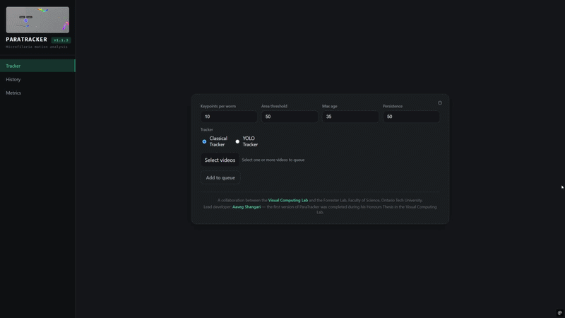

# ParaTracker

A full-stack application for *Microfilaria motion analysis*. The system uses skeleton-based keypoint extraction to capture body posture and deformation over time, enabling quantitative behavioral analysis. Two selectable tracking pipelines are available: a classical computer vision approach that requires no training data, and a deep learning pipeline powered by a custom-trained YOLOv8-seg instance segmentation model.

<p align="center">
  
</p>

## Demo Videos

<!-- TODO: Add demo video links once recorded -->
<!-- 
| Video | Description |
|---|---|
| [Overview & Introduction](#) | What the project is and why it matters |
| [Upload & Processing](#) | Multi-file upload, job queue, cancellation |
| [Results & Comparison](#) | Video comparison slider, color-coded keypoints, head/tail correction |
| [Job Management](#) | Job history, re-run with new parameters, delete jobs |
| [Motion Analysis](#) | Heatmap, timeline charts, rolling average, legend hover |
| [Export & Data](#) | CSV/ZIP download, output file formats |
-->

*Coming soon: short walkthrough videos for each feature area.*

## Technology Stack

| Layer | Technology |
|---|---|
| Backend | Python 3, FastAPI |
| Frontend | React, Vite, Recharts |
| CV / Scientific | OpenCV, scikit-image, SciPy, NumPy |
| ML / Deep Learning | PyTorch (CUDA), Ultralytics YOLOv8-seg, pycocotools |
| Database | SQLite |
| Video | FFmpeg (H.264 transcoding) |
| Communication | Server-Sent Events (SSE) |

## Getting Started

ParaTracker runs as a backend (FastAPI, port 8000) plus a frontend dev server (Vite, port 5173). Helper scripts handle installing dependencies, downloading the tracking model, freeing the ports, and starting both servers together: a `Makefile` for macOS/Linux and an equivalent `dev.ps1` for Windows.

Follow the steps below **in order**. You only need to do the setup steps (1 through 4) once.

> For Windows commands, please use ***Powershell***.

### 1. Install prerequisites

You need these installed on your computer before anything else:

1. **Python 3.11**: <https://www.python.org/downloads/>
2. **Node.js 18 or newer** (this also installs `npm`): <https://nodejs.org>
3. **FFmpeg** (for video processing):
   - macOS: `brew install ffmpeg`
   - Linux: `apt install ffmpeg`
   - Windows: download from <https://www.gyan.dev/ffmpeg/builds/> or run `choco install ffmpeg`

> Note: NumPy must stay below version 2 (NumPy 2.x breaks the image-processing libraries). It's already pinned in `requirements.txt`, so as long as you don't manually upgrade it, you're fine.

### 2. Download the project

```bash
git clone https://github.com/vclab/worm-tracker.git
cd worm-tracker
```

Alternatively, you can download the project as a zip file and then do the following:

1. Extract the zip file anywhere on your device.
2. Go into the extracted folder, right-click anywhere and then select 'Open in Terminal'.

### 3. Download the tracking model (required, do this before running)

The YOLO tracking model is **not** included in the download and must be fetched separately. The YOLO tracker will not work without it. Run the matching command for your system:

**macOS / Linux:**
```bash
make weights
```

**Windows:**
```powershell
.\dev.ps1 weights
```

This downloads the model from Google Drive and verifies it automatically. It only needs to be done once; the model is saved into the `weights/` folder and reused after that.

> If you skip this step, using the YOLO tracker on Windows will fail because it can't find the model. (On macOS/Linux, `make run` will download it for you if you forgot, but it's cleaner to do it here first.)

### 4. Start the app

**macOS / Linux:**
```bash
make run
```

**Windows:**
```powershell
.\dev.ps1 run
```

This installs any remaining dependencies, starts the backend (port 8000) and the frontend (port 5173) together, and stops both cleanly when you press **Ctrl+C**.

Then open **<http://127.0.0.1:5173>** in your web browser. That's the app.

---

### Other commands

You won't normally need these, but they're available.

**macOS / Linux (`make <target>`):**

| Target | What it does |
| --- | --- |
| `make run` | Start backend + frontend |
| `make weights` | Download and verify the YOLO model |
| `make venv` | Create the Python environment (`~/venv/worm-tracker`) and install requirements |
| `make build` | Install frontend dependencies |
| `make dist` | Build the standalone macOS app bundle (see below) |
| `make clean` | Remove caches, frontend build, and `build/`+`dist/` |
| `make clean-python` | Remove `__pycache__` and compiled Python files |
| `make clean-python-env` | Remove the Python virtual environment |
| `make clean-frontend` | Remove `frontend/dist` and `frontend/node_modules` |
| `make clean-build` | Remove `build/` and `dist/` |
| `make clean-weights` | Remove the downloaded model |

**Windows (`.\dev.ps1 <target>`):**

| Target | What it does |
| --- | --- |
| `.\dev.ps1 run` | Start backend + frontend |
| `.\dev.ps1 weights` | Download and verify the YOLO model |
| `.\dev.ps1 venv` | Create the Python environment (`.\venv`) and install requirements |
| `.\dev.ps1 build` | Install frontend dependencies |
| `.\dev.ps1 clean` | Remove caches and frontend build |
| `.\dev.ps1 clean-python` | Remove `__pycache__` and compiled Python files |
| `.\dev.ps1 clean-python-env` | Remove the Python virtual environment |
| `.\dev.ps1 clean-frontend` | Remove `frontend/dist` and `frontend/node_modules` |
| `.\dev.ps1 clean-weights` | Remove the downloaded model |

> The Python virtual environment is created in a different place on each system: `~/venv/worm-tracker` on macOS/Linux, and `.\venv` inside the project folder on Windows.

---

### Building a self-contained app (macOS)

To produce a `ParaTracker.app` that runs on machines with no Python or Node installed (FFmpeg is bundled):

```bash
make dist
```

This runs a full clean rebuild and ad-hoc signs the `.app`. Launch it with:

```bash
open dist/ParaTracker.app       # normal launch
dist/ParaTracker/ParaTracker    # folder-mode binary; shows server logs in the terminal
```

To also package the `.app` into a DMG for distribution (this is what we upload to GitHub Releases):

```bash
make release
```

Produces `dist/ParaTracker-<version>-arm64.dmg`. `make release` is `make dist` followed by `make dmg`; use `make dmg` on its own to repackage an existing `.app` without rebuilding.

The DMG is Apple Silicon only (arm64). It is ad-hoc signed but NOT notarized (we have not paid Apple's yearly Developer Program fee since this is free research software). The DMG bundles a "READ ME FIRST.txt" that walks first-launch users through the required right-click + Open step to bypass Gatekeeper.

**Windows installer**: on the roadmap. Windows users currently need to build from source (steps 1 through 4 above).

**YOLO pipeline in the packaged app**: the model file is not yet bundled inside the `.app` (planned for the next release). For now, the packaged app supports only the classical pipeline out of the box. To use YOLO, build from source and download the weights via `make weights`.

### Uninstalling

A full uninstall requires deleting three things: the app itself, its config directory, and its outputs directory. Trashing only the app (or running the source-tree `make clean` targets) leaves your job history, results, and settings on disk.

**macOS:**

```bash
rm -rf /Applications/ParaTracker.app                # the app
rm -rf ~/Library/Application\ Support/ParaTracker   # config (settings, YOLO model path)
rm -rf ~/Documents/ParaTracker                      # outputs: jobs.db, tracked videos, keypoints, CSVs, uploads
```

**Windows** (no packaged installer yet; run from source):

```powershell
Remove-Item -Recurse -Force "$env:APPDATA\ParaTracker"                 # config
Remove-Item -Recurse -Force "$env:USERPROFILE\Documents\ParaTracker"   # outputs
```

**Linux:**

```bash
rm -rf ~/.config/ParaTracker                        # config
rm -rf ~/Documents/ParaTracker                      # outputs
```

**If you moved your outputs directory** via Settings (⚙ in the UI) to a custom location (e.g. an external drive), delete that location instead of `~/Documents/ParaTracker`. The path is stored under `outputs_dir` in `config.json` inside the config directory shown above; open that file before deleting the config directory if you're not sure.

**Upgrading from v1.3.0 or earlier?** The app was previously named WormTracker. On first launch of v1.4.0 the old `WormTracker` config and outputs directories are automatically renamed to `ParaTracker` in place, so your existing jobs and settings carry over untouched. Nothing to do manually.

**If you built from source**, you may also want to remove:

- Python virtual environment: `make clean-python-env` (macOS/Linux, removes `~/venv/worm-tracker/`) or `.\dev.ps1 clean-python-env` (Windows, removes `.\venv\` in the project folder).
- Downloaded YOLO model: `make clean-weights` or `.\dev.ps1 clean-weights` (removes `weights/` in the project folder).
- The cloned project folder itself: just delete the `worm-tracker` directory.

### Manual run (advanced)

If you'd rather start the servers yourself instead of using the scripts, run the backend and frontend in two terminals. This skips the automatic port-cleanup and clean shutdown the scripts provide, and you must have already downloaded the model (step 3).

```bash
# Terminal 1: backend
source ~/venv/worm-tracker/bin/activate      # macOS/Linux
# .\venv\Scripts\activate                    # Windows
uvicorn app.main:app --reload --port 8000

# Terminal 2: frontend
cd frontend
npm run dev
```

## How to Use

1. Open the app in your browser
2. Select the tracking pipeline: **Classical** (threshold-based, no training data required) or **YOLO** (deep learning, better on translucent or overlapping specimens)
3. Adjust tracking parameters if needed (Keypoints, Area Threshold, Max Age, Persistence)
4. Select one or more video files and click **Add to queue**
5. Jobs are processed one at a time -- the **Job History** panel shows live progress
6. Click a completed job to load its results:
   - **Before/after comparison slider**: drag to reveal original vs. tracked video
   - **Download All (ZIP)**: tracked video, original, keypoints (`.npz`), metadata (`.yaml`), motion stats (`.json`)
   - **Export CSV**: per-worm summary and per-frame timeseries data
   - **Head/Tail Correction**: flip head/tail assignment for individual worms, then re-download
   - **Motion Analysis**: per-worm heatmap and timeline chart (overall, head, mid-body, tail motion)
7. Use **Re-run with new parameters** to reprocess the same file with adjusted parameters
8. Use **Run on another file** to reset and process a new video

### Quitting the app (packaged .app only)

Close the browser tab and the app shuts down automatically about 20 seconds later. If a job is still processing, the server waits for it to finish before quitting.

If you double-click the app while it is already running, it brings the existing browser tab forward instead of starting a second copy.

### Tracking Parameters

| Parameter | Default | Description |
|---|---|---|
| Keypoints per worm | 15 | Skeleton sample points along each worm |
| Area threshold | 50 | Minimum pixel area to consider a blob a worm |
| Max age | 35 | Frames to keep tracking a worm after it disappears |
| Persistence | 50 | Minimum frames tracked to include a worm in output |

## Export and Download Options

ParaTracker lets you export results in a few places. The two **Metrics** page exports produce analysis-ready ZIPs; the **History** page offers per-job downloads of the raw tracking outputs.
 
### Metrics page: Condition comparison export
 
The **Export** button under *Condition comparison* downloads a ZIP for all the groups you've built. It contains:
 
- **Grouped comparison chart**: as both **PNG** and **SVG**.
- **`group_summary.csv`**: one row per group × pipeline, with the worm count (`n`) and the mean and standard deviation for head, midbody, and tail motion.
- **`per_worm.csv`**: the raw per-worm rows behind those averages: group label, video, pipeline, worm ID, and head / midbody / tail / overall motion, for every worm in every group.
This export is the group-level result plus the underlying data, so you can recompute or dig into the numbers yourself. It does not include per-video metadata or raw keypoints; use the single-video export for those.
 
### Metrics page: Single video analysis export
 
The **Export** button under *Single video analysis* downloads a ZIP for the currently selected video. It contains:
 
- **Drill-down chart**: as both **PNG** and **SVG**.
- That video's **summary CSV**, **timeseries CSV**, **`motion_stats.json`**, **metadata YAML**, and **`*_keypoints.npz`** (the raw keypoints).
This is the complete, reproducible package for a single video.

### History page: per-job downloads
 
Each job row in the **History** page has its own action buttons:
 
- **View**: opens the tracked result for that job in the app (the annotated video / comparison view).
- **Video**: downloads the tracked output video (H.264 MP4).
- **ZIP**: downloads the job's **package ZIP** (`{output_name}.zip`), containing:
  | File | Description |
  | --- | --- |
  | `*_original.*` | Copy of the originally uploaded video file |
  | `*_tracked.mp4` | H.264-encoded video annotated with colored skeleton keypoints and worm IDs |
  | `*.yaml` | Metadata: git version, timestamp, tracking parameters used, frame count |
  | `*_keypoints.npz` | NumPy archive of per-worm skeleton keypoint coordinates over time (`[y, x]` per keypoint per frame; partial/edge-touching worms stored under a `partial_` key prefix) |
  | `*_motion_stats.json` | Per-worm motion values (overall, head, mid-body, tail) and aggregate stats |
  
  The package ZIP does **not** include the CSV files; those are in the separate `_data.zip` served by the "CSV" button.
- **CSV**: downloads the job's **data ZIP** (`{output_name}_data.zip`), containing the per-worm summary CSV and the per-frame timeseries CSV.
  | File | Description |
  | --- | --- |
  | `*_summary.csv` | One row per worm: mean motion values (overall, head, mid-body, tail) |
  | `*_timeseries.csv` | One row per frame window: per-worm head/mid-body/tail motion over time |
  
- **Delete**: removes the job and its outputs.

  | File | Format | Contents |
  |---|---|---|
  | `*_tracked.mp4` | H.264 video | Annotated video with colored skeleton keypoints and worm IDs |
  | `*_original.*` | original format | Copy of the input video |
  | `*_metadata.yaml` | YAML | Git version, timestamp, parameters, frame count |
  | `*_keypoints.npz` | NumPy archive | Per-worm keypoint data -- see details below |
  | `*_motion_stats.json` | JSON | Per-worm motion values (overall, head, mid-body, tail) and aggregate stats |

### Keypoints NPZ Format

```python
import numpy as np

with np.load("*_keypoints.npz") as npz:
    print(list(npz.keys()))  # e.g. ['0', '1', 'partial_2', 'partial_3']
    arr = npz["0"]           # shape: (num_keypoints, num_frames, 2)
    y, x = arr[0, 0]         # [y, x] position of keypoint 0 at frame 0
```

**Array shape:** `(num_keypoints, num_frames, 2)` -- axis 0 is keypoints along the skeleton (index 0 = head, index -1 = tail), axis 1 is frames, axis 2 is `[y, x]` pixel coordinates.

| Key pattern | Description |
|---|---|
| `"0"`, `"1"`, `"2"`, ... | Fully retained worms -- tracked for >= `persistence` frames and never touched a frame edge |
| `"partial_0"`, `"partial_2"`, ... | Partial worms -- touched a frame edge, excluded from motion analysis |

**Head/tail orientation:** keypoint 0 = head (wider end), keypoint -1 = tail (narrower end). Correctable via the Head/Tail Correction tool.


## Troubleshooting

| Problem | Solution |
|---|---|
| `command not found` (pip, python, node) | Ensure Python/Node are installed and on PATH. Restart terminal. |
| Video won't play in browser | Install FFmpeg (see prerequisites) |
| CORS / network errors | Make sure backend is running at `http://127.0.0.1:8000` |
| Port already in use | `npm run dev -- --port 5174` |
| "app is damaged" or "cannot verify developer" on macOS | Right-click the app, choose Open, then click Open in the dialog. Only needed on first launch. See the "READ ME FIRST.txt" bundled in the DMG. |
| Packaged app launches but no browser tab appears | Check that a default browser is set. The port the app is using is written to `~/Documents/ParaTracker/paratracker.port`; open `http://127.0.0.1:<that-port>` manually. |
| Double-clicked the app and nothing seems to happen | It is already running. It brought the existing browser tab forward; look at your open tabs. |
| Server keeps running after closing the browser | Give it about 20 seconds (heartbeat watchdog). Force-quit from Activity Monitor if needed. |

### CLI Usage (no UI)

Two separate module entry points; there is no unified `--pipeline` flag.

**Classical pipeline** (no model needed):

```bash
python -m app.worm_tracker input.mov output_dir \
    --keypoints 15 --min-area 50 --max-age 35 --persistence 50
```

**YOLO pipeline** (needs a weights file, e.g. from `make weights`):

```bash
python -m app.dl_worm_tracker input.mov output_dir \
    --model weights/worm_yolov8seg-<sha>.pt \
    --keypoints 15 --min-area 50 --max-age 35 --persistence 50 \
    --conf-threshold 0.25
```

Both write to `output_dir/{timestamp}_{output_name}/` and produce the same output-file layout as the web UI.

## Authors

- [Aaveg Shangari](https://avishangari.github.io/aaveg-portfolio/index.html) (*[linkedin](https://www.linkedin.com/in/aaveg-shangari/)*)
- Faisal Qureshi

[VCLab](https://www.vclab.ca), Faculty of Science, Ontario Tech University
