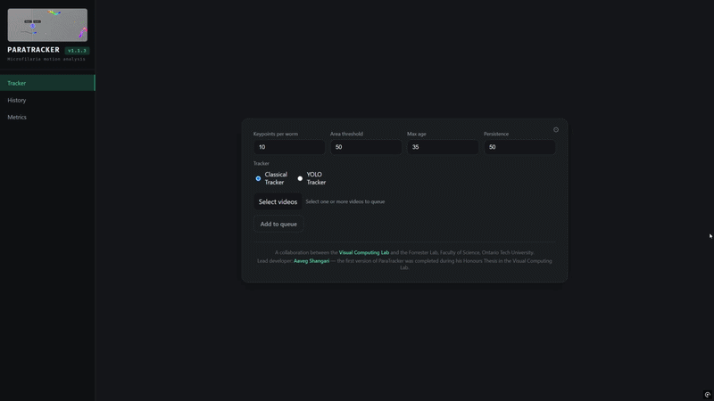
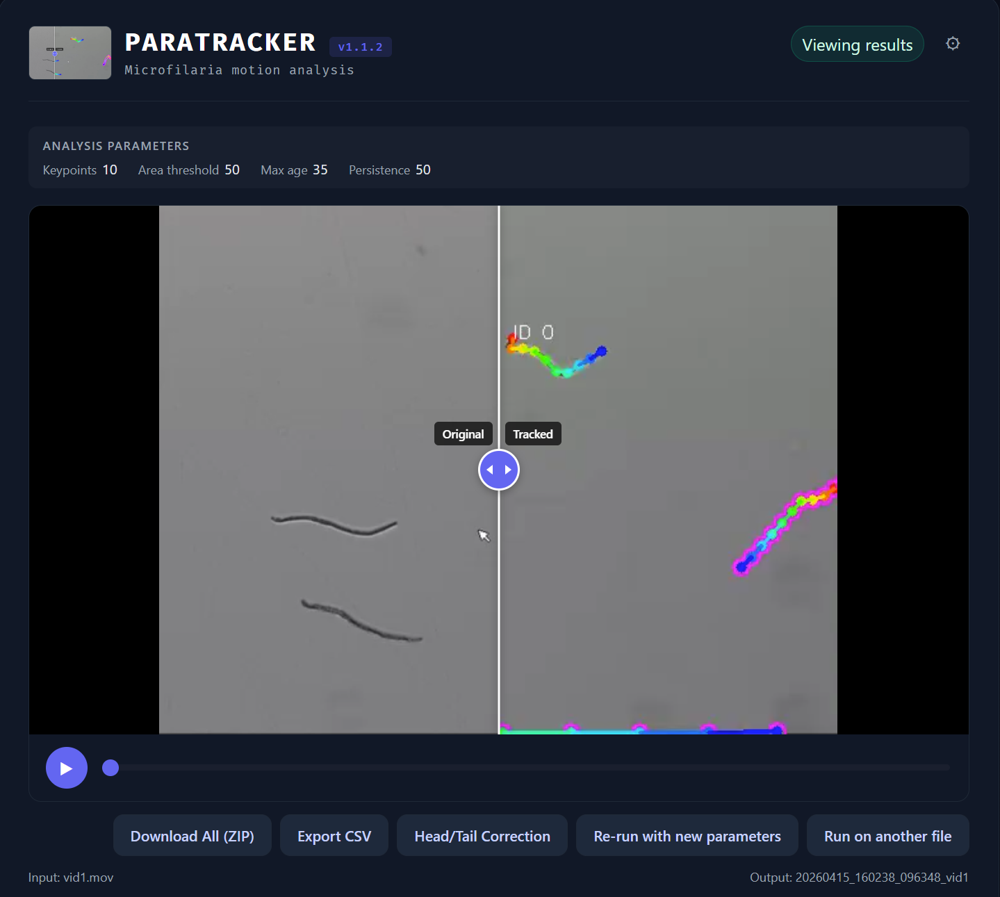
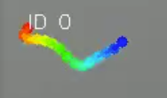
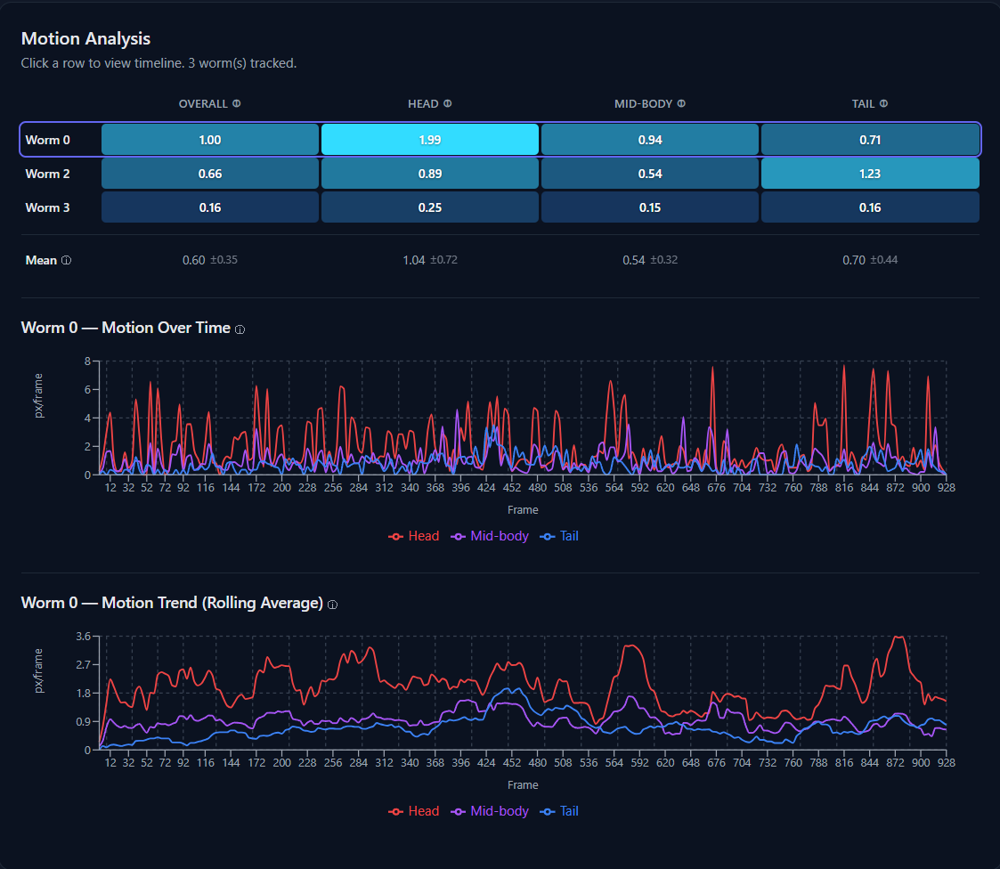
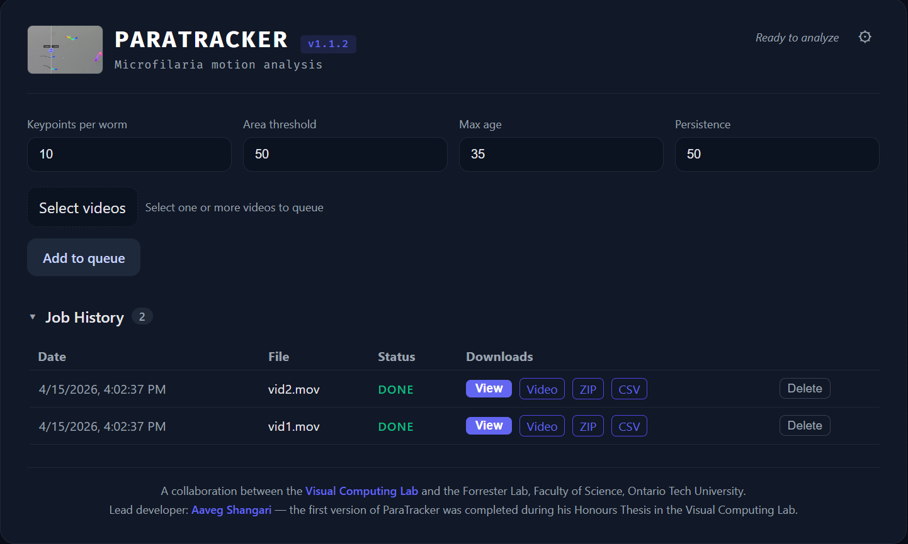
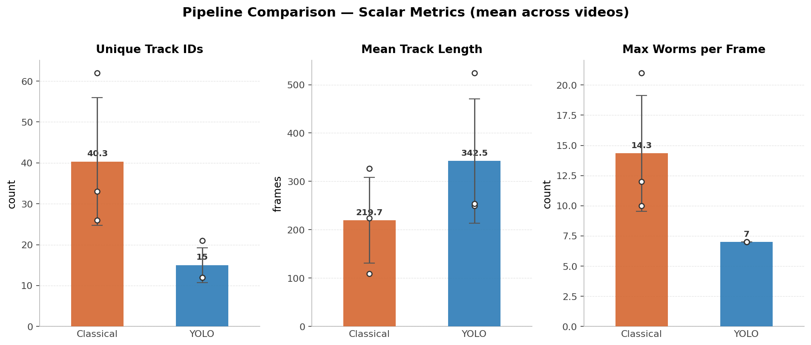
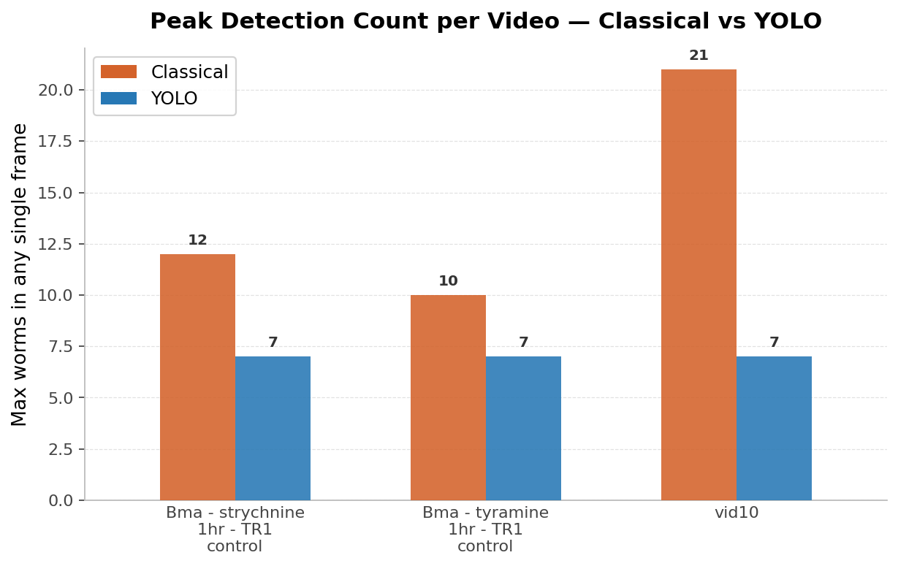

# ParaTracker

**Quantitative motion analysis for *C. elegans* and microfilaria: from raw video to publication-ready data, on your desktop.**

ParaTracker turns microscopy videos of worms into structured behavioral data. It detects each animal, extracts a skeleton-based set of keypoints along its body, and tracks how that posture deforms over time, giving you per-worm, per-region motion metrics you can compare across conditions. It runs as a local desktop app: drop in a video, watch it process, and download annotated video plus analysis-ready CSVs.

<p align="center">
  
</p>

---

## Overview

### The problem

Scoring worm motility by hand is slow, subjective, and hard to reproduce. Existing tools often demand command-line fluency, a specific OS, or a cloud upload of unpublished data. ParaTracker is built for wet-lab researchers who want rigorous, repeatable motion quantification **locally**, with no coding and no data leaving their machine.

### What it does

- **Two tracking pipelines, one click apart.** A **classical** computer-vision pipeline (adaptive threshold → skeletonization → Hungarian tracking) that needs no training data, and a **deep-learning** pipeline built on a custom-trained **YOLOv8-seg** model for translucent, overlapping, or low-contrast specimens.
- **Skeleton keypoints, not just centroids.** Each worm is reduced to an ordered set of keypoints from head to tail, so you capture body *deformation*, not merely whether the animal moved.
- **Region-resolved motion.** Separate metrics for **head**, **mid-body**, and **tail**, plus an overall score, per worm and over time.
- **Head/tail correction built in.** Auto-orientation is good, but you can flip any worm's head/tail assignment in the UI and everything downstream recomputes.
- **Cross-condition comparison.** Group videos into conditions and export grouped comparison charts and statistics.
- **Runs entirely on your machine.** No account, no server, no upload. Ships as a macOS `.app` / DMG and a Windows installer (or portable `.exe` folder).

### See it in action

<table>
  <tr>
    <td width="50%" align="center">
      <br/>
      <sub><b>Before/after slider</b>: drag to reveal original vs. tracked video.</sub>
    </td>
    <td width="50%" align="center">
      <br/>
      <sub><b>Skeleton keypoints</b>: color-coded head→tail, with per-worm IDs.</sub>
    </td>
  </tr>
  <tr>
    <td width="50%" align="center">
      <br/>
      <sub><b>Motion analysis</b>: per-worm heatmap and timeline for head, mid-body, and tail.</sub>
    </td>
    <td width="50%" align="center">
      <br/>
      <sub><b>Tunable parameters</b>: keypoints, area threshold, max age, persistence.</sub>
    </td>
  </tr>
  <tr>
    <td width="50%" align="center">
      <br/>
      <sub><b>Condition comparison</b>: aggregate motion across experimental groups.</sub>
    </td>
    <td width="50%" align="center">
      <br/>
      <sub><b>Per-video consistency</b>: spot outliers and batch effects at a glance.</sub>
    </td>
  </tr>
</table>

### Who it's for

- **Neurobiology / pharmacology labs** screening drug or genotype effects on worm locomotion.
- **Parasitology labs** quantifying microfilaria motility for anthelmintic assays.
- **Anyone** who needs reproducible, per-region motion metrics without writing tracking code or shipping data to the cloud.

### Technology stack

| Layer | Technology |
|---|---|
| Backend | Python 3.11, FastAPI, SQLite |
| Frontend | React, Vite, Recharts |
| CV / scientific | OpenCV, scikit-image, SciPy, NumPy |
| Deep learning | PyTorch, Ultralytics YOLOv8-seg |
| Video | FFmpeg (bundled via `imageio-ffmpeg`, H.264 transcoding) |

### Demo videos

*Coming soon: short walkthrough videos covering upload & processing, results & comparison, job management, motion analysis, and export.*

---

## Quick start

If you just want to run the packaged app, download the latest release for your OS (macOS DMG or Windows installer) and follow the [Running a build someone sent you](docs/build.md#running-a-build-someone-sent-you) section.

To run from source, install **Python 3.11** and **Node.js 18+**, then:

```bash
# macOS / Linux
git clone https://github.com/vclab/worm-tracker.git
cd worm-tracker
make weights
make run
```

```powershell
# Windows (PowerShell)
git clone https://github.com/vclab/worm-tracker.git
cd worm-tracker
.\dev.ps1 weights
.\dev.ps1 run
```

Open **<http://127.0.0.1:5173>**. Full per-OS instructions (prerequisites, command reference, manual run) are in [docs/install.md](docs/install.md).

---

## Documentation

- **[Installation & Development](docs/install.md)**: prerequisites, per-OS setup (Windows, macOS, Linux), command reference, manual run.
- **[Using the App](docs/usage.md)**: UI walkthrough, tracking parameters, export options, keypoints NPZ format, CLI usage.
- **[Building for Distribution](docs/build.md)**: building the macOS DMG and the Windows exe + installer, running a build someone sent you.
- **[Troubleshooting & Uninstalling](docs/troubleshooting.md)**: common problems and how to remove the app and its data.

---

## Authors

- [Aaveg Shangari](https://avishangari.github.io/aaveg-portfolio/index.html) (*[LinkedIn](https://www.linkedin.com/in/aaveg-shangari/)*)
- Faisal Qureshi

[VCLab](https://www.vclab.ca), Faculty of Science, Ontario Tech University
